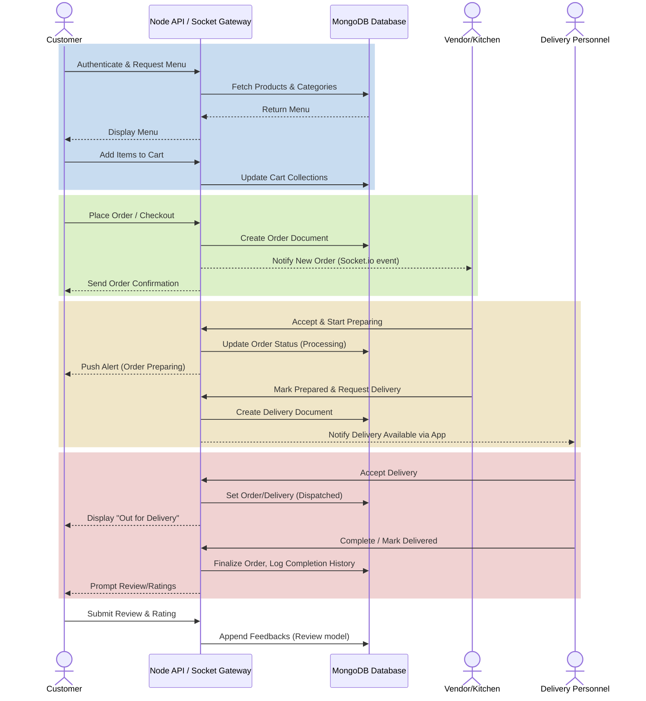

# Food Junction Backend

## Overview
Food Junction Backend is a robust RESTful API built with **Node.js, Express, and MongoDB** for a restaurant management and food delivery platform. It provides role-based access control, comprehensive order management, real-time tracking, inventory handling, and a sophisticated notification system using **Socket.io**.

## Core Features and Functionalities

- **User Authentication & Authorization**: Secured basic auth using JSON Web Tokens (JWT) with Google OAuth support (`google-auth-library`). Role-based access logic supports multiple personas: **Customer, Admin, Employee, and Vendor**.
- **Product & Menu Management**: Stores and organizes the cafe's offerings into `Categories` and `Products`. Tracks attributes like price, availability, and detailed descriptions. 
- **Cart & Order System**: Customers can manage pending items through their `Cart` and checkout to create an `Order`. The system tracks order state transitions comprehensively (Pending ➔ Preparing ➔ Dispatched ➔ Delivered).
- **Delivery Management**: Dedicated employee/driver endpoints for managing deliveries (`Delivery` model). Links orders to specific drivers and tracks geographic and delivery updates.
- **Inventory Tracking**: Monitors low stock and maintains real-time records of kitchen ingredients and miscellaneous items (`InventoryItem` model).
- **Vendor Operations**: Custom interfaces for independent restaurant partners or vendors (`Vendor` model) handling their side of multi-vendor operations.
- **Ratings & Reviews**: Enables customers to leave feedback for food and service, establishing continuous product quality averages.
- **Real-Time Notifications (`Socket.io`)**: Actively pushes delivery updates, incoming orders, and status changes directly to connected client devices—avoiding the overhead of continuous polling.
- **Audit Logging**: Uses advanced middleware combined with `winston` and MongoDB to log sensitive operations (`AuditLog` model), assuring transparency.
- **Robust Security & Safety**: Out-of-the-box middlewares reduce vulnerability through IP rate-limiting (`express-rate-limit`), security headers (`helmet`), parameter pollution defense (`hpp`), and request sanitization. Built-in Swagger documentation provides API exploration.

## System Workflow Architecture

